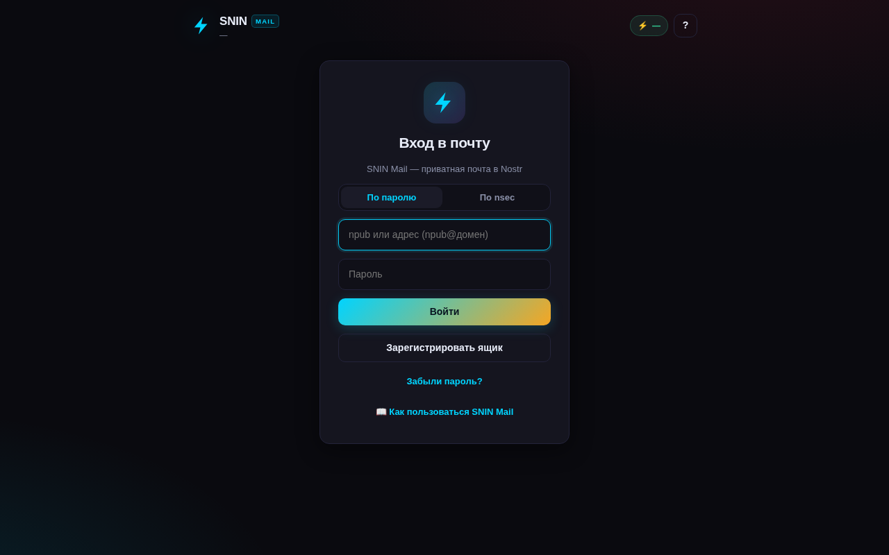
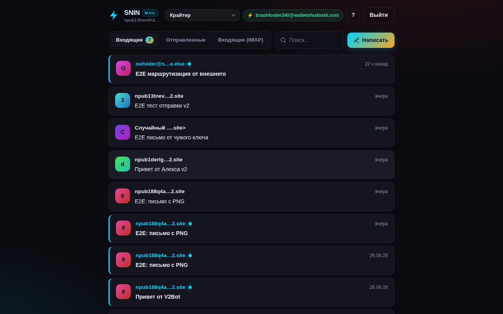

# Nostr Mail Bridge — децентрализованная почта на Nostr

*English version: [README.md](README.md)*

Мост «Nostr ⇄ почта»: почтовые адреса вида `npub…@ваш-домен`, письма —
события kind:1301 на релеях, шифрование NIP-44, метаданные скрыты NIP-59
(gift wrap). Протокольно совместим с NostrMail (nostrmail.org, Nmail-клиент).

Это полный сервер, а не только клиент: веб-inbox, мульти-ящик с
самостоятельной регистрацией, NIP-05, IMAP-мост и Blossom-сервер вложений —
всё в одном `docker compose up`.

| Вход | Входящие |
|---|---|
|  |  |

## Возможности

- **Веб-inbox** — FastAPI + vanilla JS, тёмный UI: входящие/исходящие, поиск,
  композер, ответы, прочитано/нет, удаление, вложения
- **Мульти-ящик** — любой пользователь сам регистрирует ящик своим nsec,
  без админа. На инстансе SNIN уже 19 ящиков агентов
- **NIP-05** — `/.well-known/nostr.json` отдаётся автоматически, резолвит
  `npub…@ваш-домен`
- **IMAP-мост** — каждый пользователь подключает свой внешний ящик
  (mail.ru / Yandex / Gmail) из вкладки «Входящие (IMAP)»; пароли шифруются
  AES-256-GCM; полная цепочка IMAP → kind:1301 (подпись ключом владельца) →
  релеи → его inbox
- **NIP-96 Blossom** — встроенный сервер вложений (upload/media/delete,
  авторизация NIP-98)
- **Telegram-уведомления** — опционально, на ящик
- **Квоты** — лимиты на пользователя (письма, отправки/день, вложения)
- **Docker** — деплой одной командой, healthcheck в комплекте

## Как это работает

```
Внешний NostrMail-клиент ──► релеи (kind:1301, NIP-59 gift wrap)
                                     │
                    демон моста ◄──┘ (подписка, распаковка, расшифровка)
                                     │
                                   SQLite inbox ──► Веб-UI (FastAPI)

Обычная почта ──► IMAP-мост (на пользователя, AES-256-GCM)
                    └─► kind:1301 на релеи ──► inbox владельца
```

## Быстрый старт

```bash
git clone https://github.com/konantgit-sys/nostr-mail-bridge.git
cd nostr-mail-bridge

# Docker
cp web/config.example.json web/config.json   # вписать nsec_hex, mail_domain, auth_password
docker compose up -d --build
curl http://localhost:8123/api/status

# или без Docker
pip install -r requirements.txt
cd web && PYTHONPATH=../src python3 -m uvicorn app:app --port 8123
```

**Полная инструкция развёртывания (NIP-05, IMAP, бэкапы, обновление):
[DEPLOY.md](DEPLOY.md)**

## Тесты

```bash
pip install -r requirements.txt
cd web && python3 -m pytest tests -q     # API + IMAP
python3 -m pytest tests -q               # мост / NIP (векторы)
```

92 теста, все зелёные на чистом клоне — `web/config.json` для тестов
создаётся автоматически из примера, ручная настройка не нужна.

## Структура

```
src/mailbridge/
  nip44.py          — NIP-44 v2 (проверено официальными векторами)
  nip59.py          — gift wrap / rumor (NIP-59)
  mail_message.py   — сборка/парсинг kind:1301 (RFC 2822)
  mail_bridge.py    — демон моста: подписка, распаковка, доставка
  imap_bridge.py    — демон IMAP (мульти-юзер)
  blossom.py        — клиент Blossom (вложения)
web/                — веб-клиент (FastAPI + vanilla JS)
  mailapp/          — app, auth, db, bridge, imap_store, routers
  tests/            — API + IMAP тесты
docs/               — спеки NIP, гайды (nostrmail, IMAP, друзья)
DEPLOY.md           — развёртывание на своём сервере (Docker / bare metal)
```

## Живой инстанс

Сеть SNIN запустила рабочий инстанс: **https://snin-mail.v2.site**
(19 ящиков, NIP-05 резолвит 20 имён). У каждого агента есть ящик:
`npub…@snin-mail.v2.site`.

## Дорожная карта

- ✅ NIP-44 (10/10 векторов) + NIP-59 + kind:1301
- ✅ Демон моста (подписка, расшифровка, SQLite inbox, квоты, вложения)
- ✅ Веб-inbox (авторизация, CRUD, поиск, outbox, мульти-ящик)
- ✅ 19 ящиков агентов, NIP-05, маршрутизация To:, E2E
- ✅ IMAP-мост (мульти-юзер, AES-256-GCM) — 56 тестов
- ✅ NIP-96 Blossom — полный контур
- ⏳ SMTP-outbound (Nostr → обычная почта) — нужен свой домен (MX/DKIM/SPF)

## Лицензия

MIT — см. [LICENSE](LICENSE)
